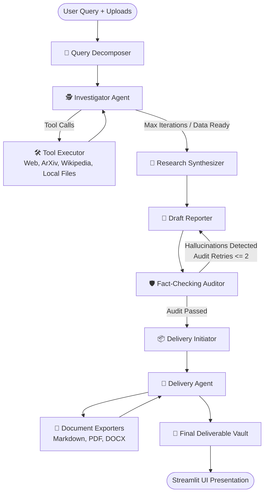

# 🧭 DeepResearch Agent

An autonomous research and analytical intelligence system built with **LangGraph**, **LangChain**, and **Streamlit**. The agent conducts multi-stage investigations, queries live web sources and academic repositories, reads uploaded local documents/PDFs, performs anti-hallucination fact-checking audits, and exports polished research deliverables into a persistent research vault.

[](https://share.streamlit.io/)
[](https://www.python.org/)
[](https://github.com/langchain-ai/langgraph)

---

## 🌟 Key Features

- **Multi-Step LangGraph State Machine**:
  - 🎯 **Query Decomposer**: Analyzes user intent, identifies search targets, and prioritizes local reference files.
  - 🕵️ **Investigator & Tool Executor**: Dispatches autonomous tool calls across web search (DuckDuckGo/Tavily), arXiv, Wikipedia, GitHub, and local file readers.
  - 🧬 **Research Synthesizer**: Distills raw tool evidence and document contents into dense, citation-backed notes.
  - 📝 **Lead Reporter**: Generates structured analytical reports with comparison tables and inline citations.
  - 🛡️ **Fact-Checking & Grounding Auditor**: Automated loop that compares draft assertions against raw gathered evidence to detect and eliminate hallucinations.
  - 📦 **Automated Delivery & Export**: Saves deliverables into the `research_vault/` and exports Markdown, PDF, or DOCX formats.
- **Multi-Provider LLM Flexibility**:
  - **Google Gemini** (`gemini-2.5-flash`, `gemini-2.0-flash`, `gemini-1.5-pro`)
  - **Groq** (`llama-3.3-70b-versatile`, `deepseek-r1-distill-llama-70b`, `llama-3.1-8b-instant`)
  - **OpenAI** (`gpt-4o-mini`, `gpt-4o`, `o3-mini`)
- **Document & File Reader Ingestion**: Upload local PDFs, DOCX, TXT, or CSV files directly through the Streamlit interface; the agent will inspect them first before initiating external queries.
- **Interactive Streamlit UI**:
  - Live execution stepper & node logs
  - Grounding audit status badges & feedback logs
  - One-click downloads (Markdown, PDF, DOCX)
  - Interactive **Research Vault** to browse and preview past reports
  - Comprehensive **Tool Catalog**

---

## 🏗️ Architecture



---

## 🚀 Quickstart (Local Setup)

### 1. Clone the Repository
```bash
git clone https://github.com/<your-username>/<your-repo-name>.git
cd <your-repo-name>
```

### 2. Create and Activate Virtual Environment
```bash
# Windows
python -m venv .venv
.venv\Scripts\activate

# macOS / Linux
python3 -m venv .venv
source .venv/bin/activate
```

### 3. Install Dependencies
```bash
pip install -r requirements.txt
```

### 4. Configure Environment Variables
Copy `.env.example` to `.env`:
```bash
cp .env.example .env
```
Fill in at least one of the following API keys:
- `GOOGLE_API_KEY`: [Google AI Studio](https://aistudio.google.com/)
- `GROQ_API_KEY`: [Groq Console](https://console.groq.com/keys)
- `OPENAI_API_KEY`: [OpenAI Platform](https://platform.openai.com/api-keys)

### 5. Run the Streamlit UI
```bash
streamlit run app.py
```
Open `http://localhost:8501` in your browser.

---

## ☁️ Deploy to Streamlit Community Cloud

This project is pre-configured for instant deployment on [Streamlit Community Cloud](https://streamlit.io/cloud):

1. **Push your code to GitHub**:
   ```bash
   git init
   git add .
   git commit -m "Deploy DeepResearch Agent to Streamlit Cloud"
   git branch -M main
   git remote add origin https://github.com/<your-username>/<your-repo-name>.git
   git push -u origin main
   ```
2. Navigate to **[share.streamlit.io](https://share.streamlit.io/)** and sign in with GitHub.
3. Click **"New app"**, select your repository and branch (`main`), and set **Main file path** to `app.py`.
4. Click **"Advanced settings..."** ➔ **Secrets**, and enter your keys:
   ```toml
   GOOGLE_API_KEY = "your_google_gemini_api_key"
   GROQ_API_KEY = "your_groq_api_key"
   OPENAI_API_KEY = "your_openai_api_key"
   OPENWEATHERMAP_API_KEY = "your_openweathermap_api_key"
   ```
5. Click **"Deploy!"** 🎉

---

## 📂 Project Structure

```
├── app.py                     # Streamlit User Interface
├── research_web.py            # LangGraph Multi-Agent Workflow & State Graph
├── requirements.txt           # Deployment-ready Python dependencies
├── .env.example               # Environment variables template
├── .gitignore                 # Excludes secrets, caches, and virtual environments
├── .streamlit/
│   ├── config.toml            # Streamlit theme & server configuration
│   └── secrets.toml.example   # Streamlit Cloud secrets template
├── tools/
│   ├── __init__.py            # Modular tools package initialization
│   ├── _common.py             # Sandbox & shared tool utilities
│   ├── registry.py            # Dynamic tool registry loader
│   ├── research_web.py        # Web search, ArXiv, Wikipedia, DuckDuckGo tools
│   ├── file_ops.py            # Local file reader & workspace tools
│   ├── doc_generation.py      # PDF, DOCX, and Markdown document creators
│   ├── text_nlp.py            # Sentiment analysis and NLP extractors
│   └── geo_weather.py         # Weather and geolocation tools
├── research_vault/            # Storage directory for completed research reports
└── uploads/                   # Temporary directory for uploaded user reference files
```

---

## 📜 License

MIT License. Feel free to use, modify, and distribute for personal or commercial projects.
